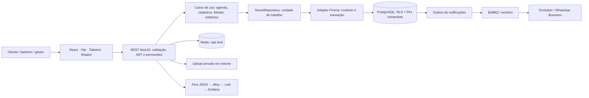

# Arquitetura e decisões

## Visão

Monorepo com frontend SPA e monólito modular. Um único PostgreSQL mantém transações fortes entre agenda, financeiro e comissões. Redis separa rate limit e execução de tarefas. Os módulos podem evoluir para serviços separados quando existirem razões operacionais comprovadas.



## Camadas

| Camada         | Responsabilidade                                           | Código               |
| -------------- | ---------------------------------------------------------- | -------------------- |
| Domain         | Perfis, estados, transições, percentuais, limites, escopos | `src/domain`         |
| Application    | Orquestração das transações e regras dos casos de uso      | `src/application`    |
| Infrastructure | Prisma, locks SQL, workers e adaptadores de mensagens      | `src/infrastructure` |
| HTTP           | Rotas, validação Zod, cookies, guards e tradução de erros  | `src/http`           |

`TenantRepository` é um port injetado pelo Nest; `Database` implementa o adapter PostgreSQL/Prisma. Casos de uso recebem o port, não criam clientes Prisma. Políticas puras não acessam rede ou banco. Transações e verificações monetárias são concentradas no servidor.

Esta versão usa uma unidade de trabalho tipada com `Prisma.TransactionClient`. Isso permite transações atômicas e substituição do adapter, mas conserva acoplamento de tipos à persistência. Uma Clean Architecture estritamente independente de ORM demanda separar ports por agregado (`AppointmentRepository`, `ClientRepository`, `SubscriptionRepository`) e seus DTOs. Essa refatoração faz parte da evolução documentada; não se declara independência total de Prisma neste código.

SOLID: regras puras separadas; adaptadores de mensagens substituíveis; autorização centralizada; inputs estritos por rota; port de transação com implementação única; camada HTTP separada dos casos de uso. Controllers de upload e gestão de contas ainda concentram operações de infraestrutura e devem ganhar casos de uso próprios antes de ampliar esses módulos.

## Isolamento multi-tenant

Cada tabela tem `tenant_id` não nulo. `tenants` define a identidade de isolamento; `companies` tem uma empresa por tenant. O tenant de plataforma é `00000000-0000-4000-8000-000000000001`.

`plans` é um catálogo de plataforma; suas linhas pertencem exclusivamente ao tenant de plataforma e têm leitura compartilhada. O usuário MASTER e a empresa interna BarberHub também pertencem ao tenant de plataforma. Uma barbearia não é proprietária dos planos. Isso evita replicar ou alterar preços em cada empresa.

Todas as referências operacionais usam `(tenant_id, id)`: um agendamento da empresa A não pode associar um cliente da B. Além das relações Prisma, a segunda migração acrescenta FK de tenant em cada tabela, constraints financeiras, exclusão de horários, triggers e políticas RLS.

Cada unidade de trabalho define `app.tenant_id` e `app.is_master` com `set_config(..., true)`. O contexto é local à transação, não vaza para a próxima requisição do pool. Sem contexto, o papel restrito não lê registros operacionais. O banco força RLS mesmo para o proprietário não-superuser; a aplicação nunca utiliza o papel de migração.

Login precisa localizar a empresa pelo slug e verificar a senha. Esse caminho interno e os workers usam um contexto de plataforma, sem expor acesso genérico ao navegador. Depois do login, `tenant_id` vem do JWT validado. Não existe cabeçalho `X-Tenant-ID` que possa trocar a empresa.

## Estrutura de pastas

```text
barberhub/
├── apps/
│   ├── web/
│   │   ├── src/
│   │   │   ├── components/ui/        # Button, Card, Dialog e Input
│   │   │   ├── components/shared.tsx # Avatar, Badge, Field, Select, Kpi
│   │   │   ├── pages/Dashboard.tsx   # Gráficos, KPIs, performance e agenda
│   │   │   ├── lib/data.ts           # Contrato, transporte e adapter demo
│   │   │   ├── lib/utils.ts          # BRL, datas, classes
│   │   │   ├── App.tsx               # Shell, navegação e demais módulos
│   │   │   ├── main.tsx              # React Query, tema e notificações
│   │   │   └── styles.css            # Tokens, temas e responsividade
│   │   ├── components.json
│   │   └── vite.config.ts
│   └── api/
│       ├── prisma/
│       │   ├── schema.prisma
│       │   ├── seed.ts
│       │   └── migrations/           # Schema + RLS/constraints/triggers
│       ├── src/
│       │   ├── domain/
│       │   ├── application/
│       │   ├── infrastructure/
│       │   ├── http/
│       │   └── main.ts
│       └── test/                     # Domínio e integração PostgreSQL
├── infra/                           # Dockerfiles, Nginx, logs, papel DB
├── scripts/database.cjs             # Ambiente e comando de banco
├── docs/                            # Os dez entregáveis
├── compose.yaml
├── .env.example
└── package-lock.json
```

## Decisões de dados

- Dinheiro em centavos inteiros; valores negativos não representam saída: `EntryType.EXPENSE` define o sinal no demonstrativo.
- Instantes de agenda em `timestamptz`; expediente no fuso IANA da empresa. Nascimento é `date`.
- Reservas usam intervalos `[início, fim)`, permitindo dois atendimentos adjacentes.
- Preço, duração resultante e percentual de comissão são snapshots da reserva. Reagendamento recalcula pelos valores atuais e gera novos lembretes.
- Pagamento e comissão são únicos por agendamento. A entrada financeira vinculada ao pagamento também é única.
- Estoque tem saldo materializado e livro de movimentações, atualizados na mesma transação.
- Auditoria aceita inserções e consultas pelo papel runtime; UPDATE/DELETE são revogados nesse papel.
- Metadados de upload ficam no banco; arquivos ficam fora da raiz pública.

## Extensões do schema

Além das tabelas solicitadas, existem `tenants`, `units`, `business_hours`, `schedule_blocks`, `categories`, `suppliers`, `refresh_tokens`, `audit_logs`, `reviews`, `uploads` e `subscription_events`. As constraints SQL são complementares ao schema Prisma; usar apenas `db push` não instala a segurança completa. Use as migrações.
