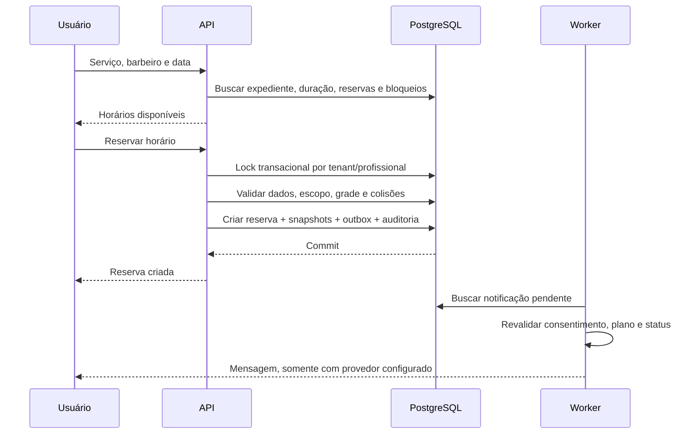
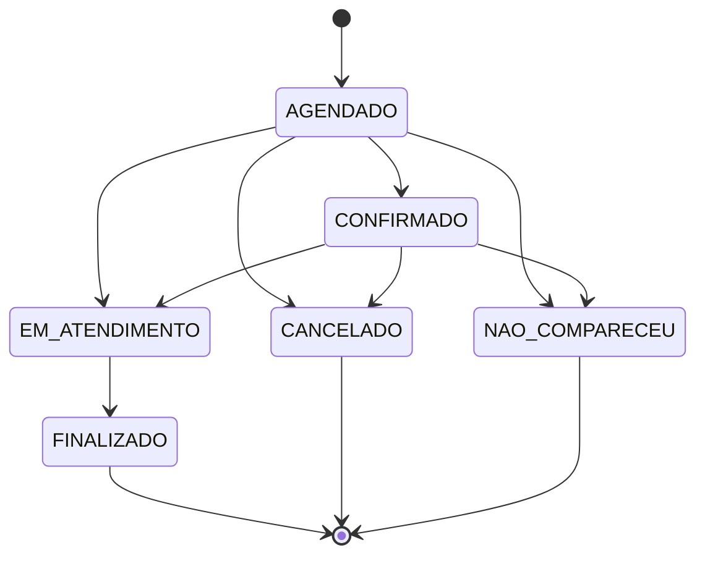

# Fluxos de negócio

## Onboarding da empresa

MASTER informa nome, slug, plano e administrador. Em uma transação são criados tenant, empresa, usuário EMPRESA, unidade, expediente padrão e evento de assinatura. O administrador pode cadastrar equipe, serviços e clientes e vincular contas de usuários a barbeiros/clientes. Uma criação incompleta é revertida integralmente.

Planos são dados de plataforma. A feature libera uso, não comprova uma assinatura paga. A data de vencimento é operacional; suspensão automática por inadimplência depende do futuro provedor de cobrança.

## Agendamento

A grade avança em passos de 15 minutos. O fim de cada opção considera a duração do serviço e o fechamento da unidade. Horários passados, folgas/férias/almoço e reservas ativas são removidos. Disponibilidade é uma consulta; confirmação sempre refaz a validação dentro da transação.

Constraints de exclusão no PostgreSQL impedem sobreposição mesmo em inserções concorrentes. Triggers protegem cruzamentos entre agenda e bloqueios. Intervalos adjacentes são permitidos.

Barbeiro só reserva sua agenda para clientes que já constam de seu histórico. A empresa cadastra o primeiro atendimento de um cliente novo. Cliente só reserva para si; preço e comissão não vêm do navegador.

## Estados

Cliente pode cancelar próprios AGENDADO/CONFIRMADO. Empresa e barbeiro autorizado podem registrar as demais transições. Estados terminais não reabrem pelo endpoint. Finalização repetida retorna o estado existente sem duplicar recebimento.

## Finalização e comissão

Empresa/profissional escolhe método de pagamento. O servidor registra pagamento único, entrada vinculada, comissão quando o plano permite, mudança de status e auditoria no mesmo commit. Uma falha reverte todo o conjunto.

Exemplo: reserva de R$50,00 com comissão de 60% gera R$30,00 ao profissional. Alterar o percentual atual para 10% não muda uma reserva que guardou 60%. Valores em centavos são arredondados uma única vez. Comissões geradas não significam pagamento ao profissional; baixa de comissão e conciliação são etapas futuras.

## Reagendar/cancelar

Reagendamento apenas de AGENDADO/CONFIRMADO. O servidor valida o novo horário, bloqueia os profissionais na mesma ordem para reduzir deadlock, preserva o id da reserva e atualiza snapshots pelos preços atuais. Notificações pendentes antigas são canceladas e novas são criadas. Cancelamento libera o horário e cancela as mensagens pendentes.

## Financeiro

Recebimentos de serviços vêm da finalização, nunca da mera reserva. Entradas avulsas e saídas têm categoria opcional, método e data. Receita do dashboard operacional e entradas totais do caixa são métricas distintas. O demonstrativo entregue é gerencial em regime de caixa. Estornos, parcelamento, impostos, contas a pagar/receber e competência contábil devem ganhar regras próprias.

## Estoque

Cadastro cria o saldo inicial e sua movimentação. Entrada usa delta positivo; saída, negativo. Saldo e movimentação compartilham commit e lock por produto. Duas retiradas concorrentes da última unidade resultam em uma retirada aceita e outra recusada. Alertas aparecem quando `quantity < minimum`. Venda de produto ainda não gera automaticamente lançamento financeiro.

## CRM e WhatsApp

CRM identifica clientes ativos/inativos, aniversariantes do mês e ausência de retorno por 15/30/60 dias, usando a última visita finalizada. Worker gera campanhas de aniversário e reativação com chaves únicas por ocorrência. Reativação considera exatamente os marcos de 15, 30 e 60 dias; não envia em toda consulta da tela.

Outbox inclui confirmação imediata e lembretes 24h/2h quando o momento ainda é futuro. Worker verifica empresa ativa, feature WhatsApp, status da reserva e consentimento atual. Sem credenciais, `WHATSAPP_PROVIDER=disabled` impede qualquer envio.

Evolution usa URL/instância/token do servidor. WhatsApp Business usa token, phone id, versão Graph e nomes de templates aprovados. Templates de agenda recebem nome, serviço e data; aniversário recebe nome; reativação recebe nome e dias. Testar esses contratos no ambiente de sandbox do provedor antes de ativar.

Entrega de mensagem externa é pelo menos uma vez: falha entre aceite do provedor e commit local pode produzir duplicidade. O outbox evita criação duplicada, mas não promete exactly-once entre sistemas externos. Cada job tem cinco tentativas com backoff; falhas finais ficam registradas para operação.

## Suspensão e troca de plano

Master suspende/ativa/cancela empresas; requests autenticados revalidam o estado e empresas suspensas não operam. Alteração registra evento e auditoria. Downgrade com unidades/equipe/clientes acima dos limites é recusado. Billing real e assinatura financeira dependem do roadmap, não de uma mudança manual de plano.

## Cliente

Cliente autenticado consulta somente seus agendamentos/histórico, cancela/reagenda nos estados permitidos e avalia atendimento finalizado uma vez. Perfil contém nome, telefone, email, nascimento e consentimento; o endpoint de perfil não aceita id ou role para alterar outra pessoa.
